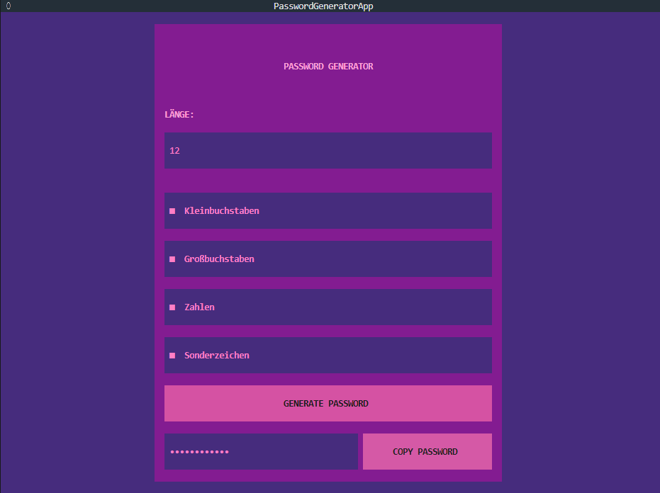

# PASSWORD GENERATOR


A simple and interactive password generator built with **Python** and **Textual**.

The application generates secure random passwords based on the selected length and character types. The generated password is hidden by default and can be copied directly to the clipboard.



## Features

- Custom password length
- Lowercase letters
- Uppercase letters
- Numbers
- Special characters
- Password hidden by default
- Copy password to clipboard
- Secure password generation using Python's `secrets` module
- Interactive terminal interface
- Retro-inspired visual design
- Keyboard-friendly interface

## What is a TUI?

**TUI** stands for **Terminal User Interface**.

A TUI is an interactive user interface that runs directly inside a terminal or console.

Unlike a traditional command-line application, which is mainly controlled by entering commands, a TUI provides interactive elements such as:

- Buttons
- Input fields
- Checkboxes
- Lists
- Tables
- Menus
- Dialogs

This allows applications to provide a graphical-like experience while still running entirely inside the terminal.

### CLI vs. TUI vs. GUI

| Type | Description |
|---|---|
| CLI | Command Line Interface – mainly operated by entering commands |
| TUI | Terminal User Interface – an interactive interface running inside a terminal |
| GUI | Graphical User Interface – a traditional graphical application with windows and visual controls |

This project is a **TUI application** because the complete user interface is rendered inside the terminal.

## Technologies

### Python

The application is written in Python.

Python provides the core application logic as well as the modules used for secure password generation and character handling.

### Textual

[Textual](https://textual.textualize.io/) is a Python framework for building interactive user interfaces that run in the terminal.

It provides the widgets and layout system used by this application.

### Secrets

Python's built-in `secrets` module is used to generate cryptographically strong random values.

The application uses:

```python
secrets.choice(allowed_chars)